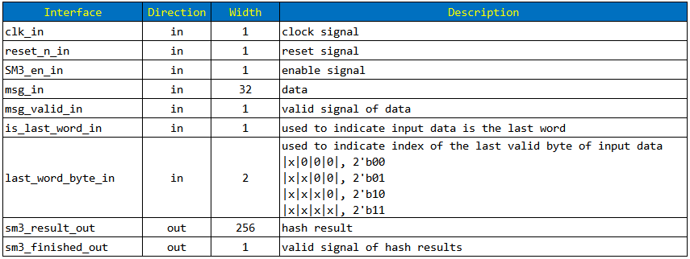
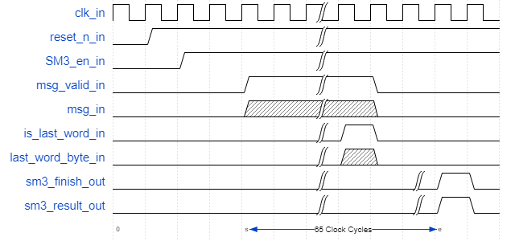

# FPGA SM3 HASH

This is an implementation of Chinese SM3 hash algorithm.

## algorithm description

please click followed links to view algorithm description.

[In Chinese: Cryptography Standardization Technical Committee](http://www.gmbz.org.cn/main/viewfile/20180108023812835219.html)

[In English: IETF draft-shen-sm3-hash-01](https://tools.ietf.org/html/draft-shen-sm3-hash-01)

## interface

## wavedrom

